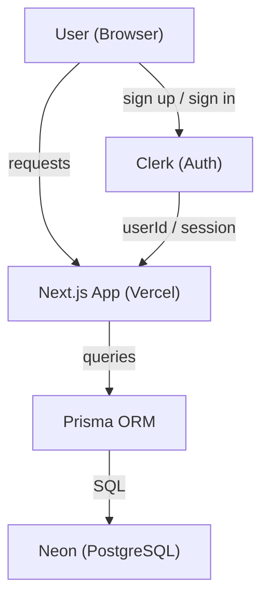
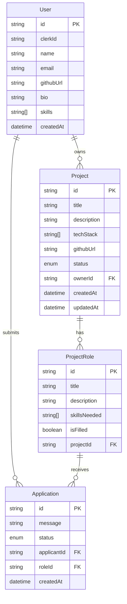
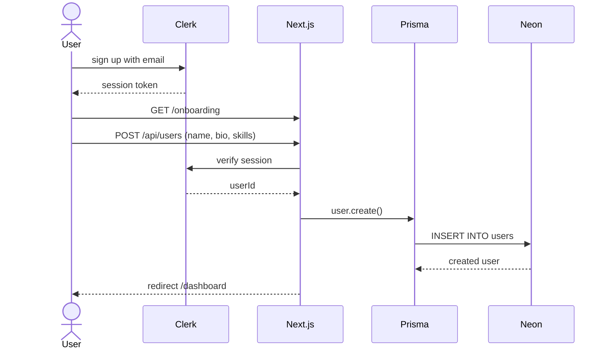
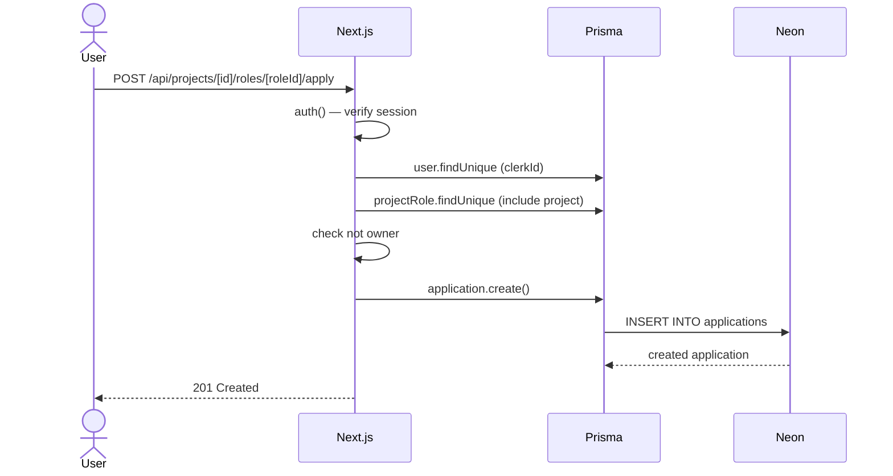
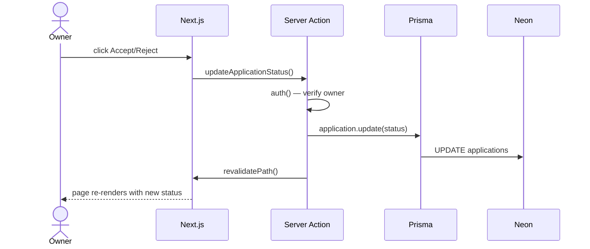
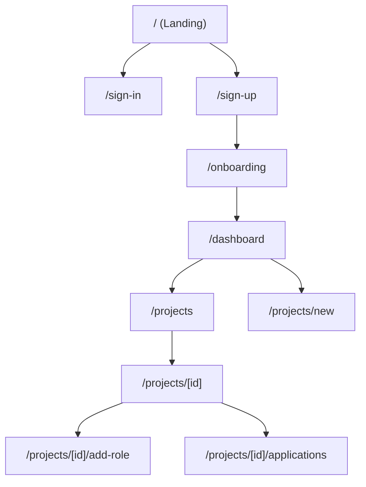

# Crucible — Architecture

## System Overview

```mermaid
graph TD
    User["User (Browser)"]
    Clerk["Clerk (Auth)"]
    Next["Next.js App (Vercel)"]
    Prisma["Prisma ORM"]
    Neon["Neon (PostgreSQL)"]

    User -->|"requests"| Next
    User -->|"sign up / sign in"| Clerk
    Clerk -->|"userId / session"| Next
    Next -->|"queries"| Prisma
    Prisma -->|"SQL"| Neon
```

## Data Model

```mermaid
erDiagram
    User {
        string id PK
        string clerkId
        string name
        string email
        string githubUrl
        string bio
        string[] skills
        datetime createdAt
    }

    Project {
        string id PK
        string title
        string description
        string[] techStack
        string githubUrl
        enum status
        string ownerId FK
        datetime createdAt
        datetime updatedAt
    }

    ProjectRole {
        string id PK
        string title
        string description
        string[] skillsNeeded
        boolean isFilled
        string projectId FK
    }

    Application {
        string id PK
        string message
        enum status
        string applicantId FK
        string roleId FK
        datetime createdAt
    }

    User ||--o{ Project : "owns"
    User ||--o{ Application : "submits"
    Project ||--o{ ProjectRole : "has"
    ProjectRole ||--o{ Application : "receives"
```

## Request Flow

### Sign Up Flow

```mermaid
sequenceDiagram
    actor User
    participant Clerk
    participant Next.js
    participant Prisma
    participant Neon

    User->>Clerk: sign up with email
    Clerk-->>User: session token
    User->>Next.js: GET /onboarding
    User->>Next.js: POST /api/users (name, bio, skills)
    Next.js->>Clerk: verify session
    Clerk-->>Next.js: userId
    Next.js->>Prisma: user.create()
    Prisma->>Neon: INSERT INTO users
    Neon-->>Prisma: created user
    Next.js-->>User: redirect /dashboard
```

### Apply to Role Flow

```mermaid
sequenceDiagram
    actor User
    participant Next.js
    participant Prisma
    participant Neon

    User->>Next.js: POST /api/projects/[id]/roles/[roleId]/apply
    Next.js->>Next.js: auth() — verify session
    Next.js->>Prisma: user.findUnique (clerkId)
    Next.js->>Prisma: projectRole.findUnique (include project)
    Next.js->>Next.js: check not owner
    Next.js->>Prisma: application.create()
    Prisma->>Neon: INSERT INTO applications
    Neon-->>Prisma: created application
    Next.js-->>User: 201 Created
```

### Accept/Reject Application Flow

```mermaid
sequenceDiagram
    actor Owner
    participant Next.js
    participant Server Action
    participant Prisma
    participant Neon

    Owner->>Next.js: click Accept/Reject
    Next.js->>Server Action: updateApplicationStatus()
    Server Action->>Server Action: auth() — verify owner
    Server Action->>Prisma: application.update(status)
    Prisma->>Neon: UPDATE applications
    Server Action->>Next.js: revalidatePath()
    Next.js-->>Owner: page re-renders with new status
```

## Page Structure

```mermaid
graph TD
    Root["/ (Landing)"]
    SignIn["/sign-in"]
    SignUp["/sign-up"]
    Onboarding["/onboarding"]
    Dashboard["/dashboard"]
    Projects["/projects"]
    NewProject["/projects/new"]
    ProjectDetail["/projects/[id]"]
    AddRole["/projects/[id]/add-role"]
    Applications["/projects/[id]/applications"]

    Root --> SignIn
    Root --> SignUp
    SignUp --> Onboarding
    Onboarding --> Dashboard
    Dashboard --> NewProject
    Dashboard --> Projects
    Projects --> ProjectDetail
    ProjectDetail --> AddRole
    ProjectDetail --> Applications
```
